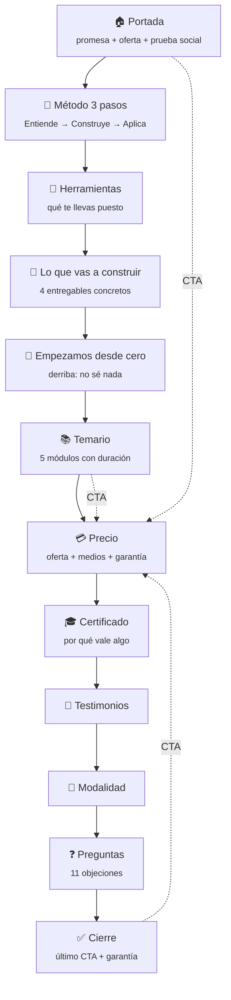

# 🚀 Landing — Curso de Claude · Relevo


> Página de venta del **01 CONOCE**, el primer curso de la ruta de Relevo. Una sola página, sin build, sin dependencias y **sin una sola cifra que no se pueda sostener**.

**[🌐 curso.relevo.academy](https://curso.relevo.academy/)** · **[📸 @relevo.academy](https://instagram.com/relevo.academy)** · **[✉️ relevoacademy@gmail.com](mailto:relevoacademy@gmail.com)**

---

## 📑 Tabla de contenidos

- [✨ Qué es](#-qué-es)
- [🧱 Cómo está armada](#-cómo-está-armada)
- [🎯 El argumento de venta](#-el-argumento-de-venta)
- [🛡️ Reglas de contenido](#️-reglas-de-contenido)
- [🎨 Identidad](#-identidad)
- [🚀 Correr localmente](#-correr-localmente)
- [📁 Estructura](#-estructura)
- [🖼️ Sobre las fotos](#️-sobre-las-fotos)
- [⚠️ Estado](#️-estado)
- [🔗 Piezas relacionadas](#-piezas-relacionadas)

---

## ✨ Qué es

Una landing de venta larga, de las que se leen de arriba abajo. El visitante llega sin saber qué es Claude y tiene que salir sabiendo tres cosas: **qué se lleva**, **por qué le sirve** y **qué pasa si no le gusta**.

Todo el contenido vive en un solo `index.html`. No hay framework, no hay paso de compilación y no hay nada que instalar para trabajar en ella.

---

## 🧱 Cómo está armada



**Decisiones clave:**

- **El CTA aparece 5 veces**: barra fija, portada, después del temario, en el precio y en el cierre. El del temario es deliberado — es el punto donde la persona ya sabe qué incluye y todavía no ha visto el precio.
- **La garantía se presenta dos veces**, junto al precio y en el cierre. Una garantía que solo aparece una vez se pierde en el scroll.
- **Las objeciones van en orden de aparición mental**, no en orden temático: primero "no sé nada", después "cuánto dura", después "ya uso ChatGPT", y al final "desde qué país".
- **Los tres pasos cierran en 60 · 60 · 60.** Los cinco módulos se reagruparon para que cada paso dure exactamente una hora: Entiende (15+45), Construye (60), Aplica (40+20). Antes sumaban 215 minutos y no coincidían con ninguna promesa de la página.
- **La grilla usa `grid-auto-rows: 1fr`.** En CSS Grid cada fila se mide por su cuenta, así que un bloque de 4 tarjetas que cae 3+1 deja la última más baja. Esto lo iguala.

---

## 🎯 El argumento de venta

| Bloque | Qué resuelve |
|--------|--------------|
| 🏠 **Portada** | Promesa + oferta visible sin scroll: ~~110~~ → 55 |
| 🧭 **Método** | *3 horas, 3 pasos* — se entiende sin leer el temario |
| 🧰 **Herramientas** | Combate el "y esto para qué me sirve después" |
| 🎁 **Lo que vas a construir** | 4 entregables, no apuntes |
| 🌱 **Desde cero** | Sin conocimientos, sin cuenta paga, sin perfil técnico |
| 📚 **Temario** | Transparencia total: cada módulo con su duración |
| 💳 **Precio** | ~~USD 110~~ → **USD 55** de lanzamiento, 50 cupos, garantía de 7 días |
| 🧾 **Medios de pago** | Los que Hotmart ofrece en Colombia — verificados, no supuestos |
| 🎓 **Certificado** | *Se aprueba, no se regala* — hay examen |
| ❓ **Preguntas** | 11 objeciones, desplegables |

---

## 🛡️ Reglas de contenido

**No se publica una cifra que no se pueda verificar.**

Esta página **no dice cuántos alumnos hay**, porque es la primera edición y no habría cómo sostenerlo si alguien pregunta. En su lugar usa una escasez que sí es real: *primera edición en vivo, cupos limitados*.

Tampoco usa contador regresivo, ni descuento inventado, ni campaña de temporada. Un contador que se reinicia solo es mentira, y una vez que el visitante lo nota **todo lo demás de la página queda bajo sospecha**.

Los números de la página tienen que coincidir con el [taller que se entrega](https://github.com/relevoacademy/modulo-conoce):

| Dato | Valor |
|------|-------|
| Duración | **3 horas en vivo** |
| Método | **3 pasos: Entiende → Construye → Aplica** |
| Módulos | 5 (01 a 05), repartidos en los 3 pasos |
| Herramientas | 7 |
| Precio regular | USD 110 |
| Precio de lanzamiento | USD 55 — **primeros 50 inscritos** |
| Garantía | 7 días |
| Certificado | Con examen aprobado |

> Si cambia el taller, **la landing cambia en el mismo commit**. El certificado también lleva la duración — son tres piezas que se mueven juntas.

### 💰 La regla del precio de lanzamiento

USD 55 es una **promoción real sobre un precio real**: el curso vale USD 110 y así se venderá a partir de la segunda edición.

Para que el tachado sea legítimo —y no un descuento ficticio, prohibido por el Estatuto del Consumidor— la promoción **tiene que terminar**. Su condición es **los primeros 50 inscritos**, y está escrita en la página y en el artículo 4 de los Términos.

> **Alcanzados los 50, el precio sube.** Si no sube, el USD 110 nunca fue real y toda la página queda bajo sospecha. Es la misma trampa del *75% OFF permanente* que se le critica a la competencia.

---

## 🎨 Identidad

Sigue el `RELEVO_MANUAL DE IDENTIDAD`, igual que las otras piezas de la marca.

| Token | Valor |
|-------|-------|
| Negro | `#050505` |
| Carbón | `#131415` |
| Turquesa | `#1FE6AB` |
| Gris | `#A7ABAF` |
| Títulos y cuerpo | Instrument Sans |

**El ámbar `#E8A33D` es solo para advertencias.** En esta página se usa únicamente en los avisos de contenido pendiente — y esos avisos son visibles a propósito, para que nadie publique sin resolverlos.

> ⚠️ El manual trae **dos erratas**. El hex del gris figura como `#67A6A3` pero sus propios valores RGB (167, 171, 175) dan `#A7ABAF`. Y la tipografía aparece como *"Instrumental Sans"* cuando la real es **Instrument Sans**.

---

## 🚀 Correr localmente

```bash
python -m http.server 8841
```

**Desplegar:** subir la carpeta tal cual. En Vercel, framework **Other**, sin build command, output directory la raíz. Todas las rutas son relativas — no hay nada que apunte fuera de esta carpeta.

> ⚠️ Conectar desde la cuenta de Vercel **de Relevo**. Verificar la cuenta activa antes de importar, no después.

---

## 📁 Estructura

| Ruta | Contenido |
|------|-----------|
| `index.html` | La landing completa |
| `assets/relevo-lockup.png` | Logo de la marca |
| `assets/alumnos/` | 7 retratos en WebP, 28 KB en total |

---

## 🖼️ Sobre las fotos

Los siete retratos de la portada son **generados con IA**, no fotografías de personas reales. Se eligieron sobre fondo oscuro para que se asienten en el negro de la marca sin recorte visible.

Del original de 1254×1254 px se recorta el rostro y se exporta a WebP de 160 px: **28 KB las siete, contra 14,5 MB de los originales**. En pantallas de menos de 420 px se muestran solo cinco, para que la fila no apriete el texto.

**Los testimonios no llevan rostro.** Una cita solo lleva cara cuando es de una persona real que dio su permiso. Un retrato generado junto a un testimonio le presta una credibilidad que la cita todavía no se ganó.

---

## ⚠️ Estado

**La página no tiene ningún placeholder.** Se quitó todo lo que fuera contenido
de relleno, incluida la sección de testimonios: los que había eran inventados,
con nombre, edad, profesión y ciudad de personas que no existen.

> Un testimonio con nombre propio que nadie dijo no es maquetación: es publicidad
> engañosa. La sección vuelve cuando haya testimonios reales con permiso.

Queda **una sola cosa pendiente**, y no se ve en la página:

| Pendiente | Dónde |
|---|---|
| Enlace de pago de Hotmart | `const CTA_URL` — una sola constante alimenta los 5 botones |

Mientras `CTA_URL` sea `"#"`, los botones no llevan a ninguna parte.

---

## 🔗 Piezas relacionadas

| Repositorio | Qué es |
|-------------|--------|
| [`modulo-conoce`](https://github.com/relevoacademy/modulo-conoce) | El taller que esta página vende |
| [`perfil-forense`](https://github.com/relevoacademy/perfil-forense) | Taller de diagnóstico DISC, cortesía del Cripto Latin Fest |

---

Hecho con 💜 en Colombia 🇨🇴 · **Relevo — IA que trabaja contigo**
